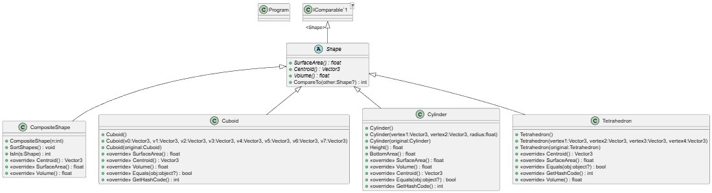
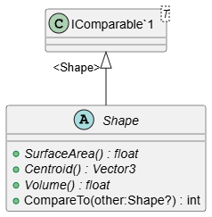
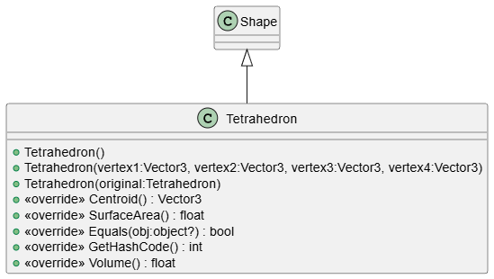
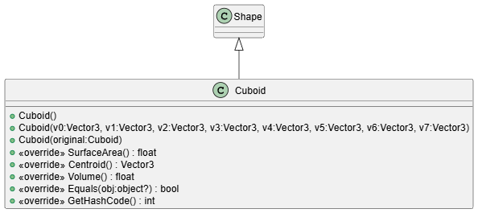
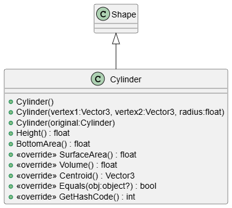
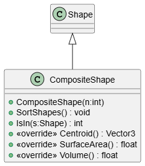

# Geometry Library Implementation Report

## 1. Architecture and Object-Oriented Design
The Geometry Library is structured around core Object-Oriented Programming (OOP) principles, specifically emphasizing **Inheritance**, **Polymorphism**, and **Encapsulation**.

* **The Abstract Base Class:** The architecture is anchored by the `Shape` abstract class. This class defines the contract that all 3D geometries must follow, demanding implementations for `SurfaceArea()`, `Volume()`, and `Centroid()`. 
* **Polymorphism in Action:** By having all primitives (`Tetrahedron`, `Cuboid`, `Cylinder`) inherit from `Shape`, we utilize polymorphism to iterate through arrays of unknown shapes and execute their specific mathematical formulas dynamically.
* **The Composite Pattern:** The `CompositeShape` acts as a wrapper that contains an array of `Shape` objects. When calling `Volume()` on a `CompositeShape`, it transparently iterates through its children, accumulating the total volume.

## 2. Mathematical Implementation
Calculations in 3D space are handled using the `System.Numerics.Vector3` struct.

* **Cuboids and Cylinders:** Implemented using standard distance calculations (`Vector3.Distance`) between mapped vertices to determine edges (Length, Width, Height) and radii.
* **Tetrahedrons:** To avoid complex trigonometric calculations, the volume of the tetrahedron is computed using the **Scalar Triple Product**. We calculate the directional vectors from the origin corner and find one-sixth of the absolute value of their dot/cross products: $Volume = \frac{| \vec{a} \cdot (\vec{b} \times \vec{c}) |}{6}$.
* **Centroids:** Calculated by averaging the structural vertices of the shape. For the `CompositeShape`, the centroid uses a **volume-weighted average** to find the true center of mass of the combined geometry.

## 3. Advanced C# Features
* **Operator Overloading:** The library utilizes operator overloading extensively. The `==` and `!=` operators are overridden to compare shapes by mapping their 3D coordinates. We use LINQ (`OrderBy`, `ThenBy`, `SequenceEqual`) to guarantee order-independent vertex equality. The `+` operator is overloaded to allow seamless addition of shapes into `CompositeShapes`.
* **IComparable Interface:** The `Shape` class implements `IComparable<Shape>`, allowing the framework to natively sort collections of shapes based on their Surface Area using `Array.Sort()`.
* **Indexers:** The `CompositeShape` overloads the `[]` indexer, allowing it to be accessed identically to a standard array.

## 4. Class Diagram

*(Below is the visual representation of the class hierarchy, showing how the primitive objects and composite containers inherit from the abstract Shape base).*

### Class relationship


#### Abstract ```Shape``` Class

#### ```Tetrahedron``` Class 

#### ```Cuboid``` Class

#### ```Cylinder``` Class

#### ```CompositeShape``` Class

